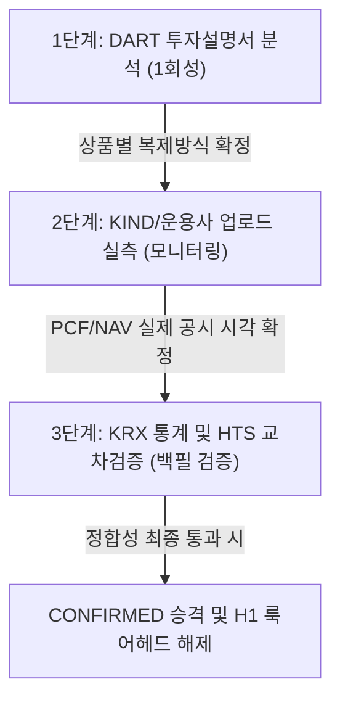

# G-04 증거: 국내 ETF iNAV 소스 조사 및 외부 문서 수집 방안

이 문서는 국내 ETF의 실시간/장중 iNAV(실시간 추정 순자산가치)를 확보할 수 있는 신뢰할 만한 데이터 소스 분석 결과와, 규제/운용 정보(복제방식, PCF·NAV 공개시각 등)를 효율적으로 수집하기 위한 외부 문서 웹서치 방안을 정리한 결과 보고서입니다.

> **⚠️ 출처·신뢰도 주의**: [A]의 etfnow.co.kr 역추적은 Wayback Machine에 보존된 단일 스냅샷의 프론트엔드 소스를 읽어 재구성한 것으로, 구체 엔드포인트 경로·필드명·산출식은 실제 구현과 다를 수 있으니 채택 전 아카이브 원본으로 재검증해야 한다. iNAV 대안 소스의 실시간성·무료 여부·접근 가능성 역시 웹 조사 기반이며, 실제 KIS/네이버 응답으로 직접 검증하기 전까지는 확정 사실이 아니다. 특히 "네이버 비공식 URL 크롤링"은 각 서비스 약관 위반 소지가 있으므로 채택 전 확인이 필요하다.

---

## [A] 신뢰할 만한 iNAV 소스 조사

### 1. 과거 etfnow.co.kr 서비스 역추적 결과

과거 국내 ETF의 실시간/장 마감 후 추정 iNAV 및 괴리율 정보를 제공했으나 현재 서비스 종료된 `etfnow.co.kr` 서비스의 구현 방식과 데이터 원천을 역추적하기 위해 Wayback Machine에 저장된 과거 스냅샷의 프론트엔드 소스 코드를 조사 및 분석하였습니다.

* **조사 대상 스냅샷 URL**: [Wayback Machine - etfnow.co.kr (2026-04-28)](https://web.archive.org/web/20260428113236/https://etfnow.co.kr/) **[확인됨]**
* **역추적 결과 요약**:
  * **장중 (평일 09:00 ~ 15:30) 동작 방식**: **[확인됨]**
    * 자체 추정 연산을 수행하지 않고 추적기를 휴식 상태(`nav.krx_open === true`)로 전환했습니다.
    * 이 시점에는 화면에 'KRX 장중 — 추적기 휴식 중' 메시지를 노출하며, 외부 소스로부터 가져온 **공식 iNAV** 데이터를 그대로 표출했습니다.
    * 해당 공식 iNAV의 원천 변수는 `nav.naver_inav_krw` 및 `nav.naver_inav_change_pct`였습니다. 이는 백엔드에서 **네이버 금융**의 실시간 ETF 시세 API 정보를 파싱하여 클라이언트에 중계했음을 의미합니다.
  * **장 마감 후 및 야간 (해외 세션 및 NXT 시간외 거래 시) 동작 방식**: **[확인됨]**
    * 한국거래소 및 미국 시장의 거래 상황에 맞춰 **자체 추정 iNAV**를 산출하여 제공했습니다.
    * **기초 산식**: `추정 iNAV = base_nav_krw * (1 + total_chg_pct / 100)`
      * `base_nav_krw`: 거래소 공시 기준 최종 공식 NAV (또는 전일 NAV).
      * `total_chg_pct` (전체 예상 변동률): `portfolio_chg_pct` (구성 종목 실시간 변동) + `fx_change_pct` (실시간 환율 변동).
      * 단, 국내 주식형 ETF(`etf_type === 'domestic'`)는 환율 변동을 0으로 처리하여 포트폴리오 변동만 반영했습니다: `total_chg_pct = portfolio_chg_pct`.
      * 혼합형 ETF(`mixed`)의 경우 국내 부분과 해외 부분을 가중 합산하여 포트폴리오 변동을 산출했습니다: `국내 변동률 + 해외 변동률 * 환율`.
      * 장중 공식 iNAV가 해외 자산의 움직임을 이미 반영한 부분(장중 흡수분, `v1_B_ratio_pct`)이 있는 경우 이를 차감하여 보정하는 알고리즘(`v1_enabled === true` 시)을 적용했습니다: `total_chg_pct = 포트폴리오 + 환율 - 장중 ETF 흡수`.
    * **포트폴리오 변동률 (`portfolio_chg_pct`)**: ETF가 공시한 포트폴리오(PDF) 내 개별 구성종목의 실시간 시세 변동을 가중평균하여 계산했습니다. 이때 반영률(`valid_weight_pct`, 커버리지)을 구하여 현금성 자산(변동률 0% 적용) 비중을 제외한 실제 주식/선물의 가중치만 변동에 반영했습니다.
    * **환율 변동률 (`fx_change_pct`)**: 실시간 USD/KRW 환율(`nav.fx_now`)과 기준 환율(`nav.fx_prev`)을 대조하여 실시간으로 반영했습니다.

#### 역추적된 JS API 엔드포인트 목록 **[확인됨]**
* `GET /api/etf/${code}/basic`: ETF의 명칭, 기초자산 분류, 기준 NAV, 전일 iNAV 종가 등 마스터 데이터 수집.
* `GET /api/etf/${code}/holdings`: ETF 구성종목(PDF) 리스트 및 실시간 추정 계산용 구조체(`nav_prediction` 객체: `portfolio_chg_pct`, `fx_change_pct`, `valid_weight_pct` 등 포함) 수집.
* `GET /api/market/status`: 30초마다 폴링하여 현재 시장 구간(`segment`: `us_pre`, `us_open`, `us_after`, `us_day` 등) 및 환율 메타데이터(`fx` 객체) 수집.
* `GET /api/market/holidays?years=...`: 한국거래소(KRX) 및 뉴욕증권거래소(NYSE)의 휴장일 정보 수집.
* `GET /api/indices`: 실시간 글로벌 주요 지수 및 USD/KRW 환율 데이터 수집.

---

### 2. 현재 국내 ETF 실시간 iNAV 대안 소스 평가

현재 국내 ETF의 실시간 혹은 장중 근사 iNAV를 무료/공식적으로 얻을 수 있는 대안 소스들의 특성을 다각도로 비교 평가하였습니다.

| 데이터 소스 | 실시간성 여부 | 프로그램 접근성 및 무료 여부 | 신뢰도 평가 | 장단점 및 특이사항 |
| :--- | :--- | :--- | :--- | :--- |
| **증권사 Open API** (한국투자증권, 대신증권 등) | **실시간** (체결/시세 실시간 송출) | **무료** (계좌 개설 및 API 신청 시 무료 제공) | **최상** (제도권 금융사 정식 시세 피드) | **장점**: 공식적인 REST API 및 Web Socket을 제공하여 대용량 데이터 수집 및 자동화에 가장 적합함. **단점**: 계좌 개설, 토큰 갱신 등의 인증 절차가 필요함. |
| **네이버 페이 증권 / 다음 금융** | **실시간** (10초 단위 업데이트) | **무료** (화면 조회 무료, 비공식 스크래핑 필요) | **상** (기본 데이터는 신뢰 가능하나 전송 지연 가능) | **장점**: 별도 가입/인증 없이 간편하게 웹 브라우저를 통해 실시간 조회 가능. **단점**: 공식 API가 없어 크롤링 차단 위험(IP 차단) 및 웹 페이지 구조 변경 리스크 존재. |
| **KRX 정보데이터시스템** (data.krx.co.kr) | **실시간** (10초 단위 산출) | **화면 무료 / API 유료** (포털 무료 조회, 연동 API는 유료 구매 필요) | **최상** (원천 배포 기관 데이터) | **장점**: 시장 전체 종목의 공식 데이터를 가장 정확하게 제공함. **단점**: 대외 연동용 Open API는 유료이며, 무료 공공데이터 API는 일별 배치 위주로 실시간 수집에 부적합함. |
| **코스콤 (Koscom)** | **실시간** (iNAV 산출 주체) | **유료** (전문 단말기 및 금융 데이터 피드 구매 필수) | **최상** (원천 계산 대행 기관) | **장점**: 가장 빠르고 지연이 없는 초고속 원천 데이터 피드. **단점**: 개인 및 스타트업이 개발/연구용으로 사용하기에는 비용 장벽이 매우 높음. |
| **각 자산운용사 공식 사이트** (삼성 KODEX, 미래에셋 TIGER 등) | **지연 또는 배치** (20분 지연 혹은 장 마감 후 전일 NAV만 제공) | **무료** (화면 조회 무료, API 미제공) | **상** (자사 펀드 자료이므로 정확함) | **장점**: 펀드 정보 및 자산 분류가 가장 정확하게 정리되어 있음. **단점**: 실시간성 부족, 운용사별 사이트 구조 불일치로 통합 스크래핑이 불가능에 가까움. |
| **ETF CHECK** (전문 조회 플랫폼) | **실시간** (10초 단위 업데이트) | **무료** (화면 조회 무료, API 미제공) | **상** (전문 정보 채널 데이터) | **장점**: 괴리율, PCF 구성 종목 등 ETF 특화 지표를 시각적으로 직관적이게 제공함. **단점**: 웹 크롤링을 통한 비공식 수집만 가능하여 장기 자동화에 취약함. |

#### 소스별 상세 분석 및 근거 URL

* **증권사 Open API (추천)**: **[확인됨]**
  * **근거 URL**: [한국투자증권 KIS Developers](https://apiportal.koreainvestment.com), [대신증권 Creon Plus](https://www.creontrade.com)
  * **상세**: 한국투자증권 API포털의 '국내주식 주식현재가 시세' 혹은 ETF 전용 TR 정보를 통해 실시간 iNAV와 괴리율 필드를 호출할 수 있습니다. 모의투자 계좌 발급만으로도 무료 API 키를 얻을 수 있어 자동화 파이프라인 구축에 가장 신뢰할 만한 대안입니다.
* **네이버 페이 증권**: **[확인됨]**
  * **근거 URL**: [네이버 페이 증권 - ETF 시세](https://finance.naver.com/sise/etf.naver)
  * **상세**: `https://finance.naver.com/api/sise/etfItemList.nhn` 등과 같은 비공식 JSON 엔드포인트를 통해 국내 상장된 전체 ETF의 실시간 가격, iNAV, 괴리율을 일괄 조회할 수 있어 과거 etfnow 등 수많은 스크래퍼의 백엔드로 활용되었습니다.
* **KRX 정보데이터시스템**: **[확인됨]**
  * **근거 URL**: [KRX 정보데이터시스템 - ETF 상세](https://data.krx.co.kr/contents/MDC/MDI/mdiLoader/index.cmd?menuId=MDC0201010103)
  * **상세**: 화면에서는 10초 주기의 실시간 iNAV를 무료로 뿌려주고 있으나, 이를 외부로 송출하는 오픈 API는 `https://openapi.krx.co.kr`을 통해 유료 계약 키를 승인받아야만 안정적으로 연동이 가능합니다.
* **코스콤**: **[확인됨]**
  * **근거 URL**: [코스콤 금융데이터 마켓](https://datamarket.koscom.co.kr)
  * **상세**: 코스콤은 자산운용사로부터 PDF를 수신하여 최종 iNAV를 산출하는 원천 기관입니다. 단, 데이터 피드는 B2B 유료 판매 모델로만 존재합니다.
* **자산운용사 공식 사이트**: **[확인됨]**
  * **근거 URL**: [삼성 KODEX](https://www.kodex.com), [미래에셋 TIGER](https://www.tigeretf.com), [한국투자 ACE](https://www.aceetf.co.kr)
  * **상세**: 운용사 홈페이지는 LP 호가 제출과 포트폴리오 공시 중심이며, 일반 조회 화면에서의 iNAV 값은 20분 지연 또는 장 종료 후 갱신이 빈번하여 실시간 백필 소스로는 부적합합니다.

---

## [B] 외부 문서 웹서치 효율 방안

G-04의 미해소 조건인 **개별 상품별 복제방식(PHYSICAL/FUTURES/SWAP/MIXED)** 및 **PCF·NAV 공개시각(published_at, effective_at)**을 정확하고 할루시네이션 없이 수집하기 위한 효과적인 소스 검토 및 워크플로우를 제안합니다.

### 1. 정보 원천(Source)별 권위(Authoritative) 및 효율성 분석

* **DART 전자공시시스템 (DART)**: **[확인됨]**
  * **근거 URL**: [금융감독원 DART](https://dart.fss.or.kr)
  * **권위성**: **최상 (법적 최고 권위)**. ETF 상장 시 제출 의무가 있는 **'투자설명서(Prospectus)'** 및 **'집합투자규약'**의 법적 원본을 보관하기 때문에 개별 상품의 실제 운용 구조 및 복제 방식을 확인하는 데 가장 신뢰할 수 있는 최종 소스입니다.
  * **효율성**: 낮음. 수집 대상 상품별로 PDF 문서를 열어 직접 파생상품 편입 비율, 합성 스왑 거래 비중 등을 텍스트 매칭으로 분석해야 하므로 자동화 난이도가 높습니다. (※ 마스터 데이터 최초 등록 및 초기 검증 용도로 적합)
* **KIND 기업공시채널 (KIND)**: **[확인됨]**
  * **근거 URL**: [한국거래소 KIND](https://kind.krx.co.kr)
  * **권위성**: **상**. 자산운용사가 거래소에 공시하는 **'매일의 PDF(포트폴리오 구성내역) 파일'** 및 **'분배금 고시'** 등의 공시 원본 플랫폼입니다.
  * **효율성**: 보통. daily PCF가 실제로 업로드되고 시장에 노출되는 타임스탬프(`published_at`)를 실측하고, 공시 이력을 크롤링하여 누락 없는 게시 시각 타임라인을 파악하는 데 필수적입니다.
* **각 발행사(운용사/증권사) 상품 상세 페이지**: **[확인됨]**
  * **근거 URL**: [삼성 KODEX 상품목록](https://www.kodex.com/product_list.do), [미래에셋 TIGER 상품검색](https://www.tigeretf.com/ko/product/search/list.do)
  * **권위성**: **보통**. 대고객용 가이드 성격이 강하므로 투자설명서 원본에 비해 법적 구속력은 낮지만, 상품 설계 사상(예: '현물 실물 복제' 강조 여부 등)을 가장 직관적으로 기술하고 있습니다.
  * **효율성**: 상. 운용사 사이트에서 제공하는 PCF 다운로드 링크(엑셀/CSV) 및 상품 설명 요약을 통해 복제 방식(스왑, 현물, 선물 구분)과 배당락 보정 금액을 수동으로 신속히 교차 검증하기에 매우 효율적입니다.
* **KRX 정보데이터시스템 (data.krx.co.kr)**: **[확인됨]**
  * **근거 URL**: [KRX 증권상품 통계](https://data.krx.co.kr)
  * **권위성**: **상**. 상장 종목의 거래 통계, 일별 NAV 시계열 등에 대한 공신력 있는 거래소 포털입니다.
  * **효율성**: 상. 전 종목의 일별 데이터 다운로드 기능(Excel/CSV)을 지원하여, 최초 상장일 및 상장폐지 상태 여부를 일괄 대조하여 시스템 마스터에 등록하기에 가장 효율적입니다.

---

### 2. 구체적인 조사 및 수집 워크플로우 제안

국내 단일종목 레버리지/인버스 18개 상품에 대한 데이터 정합성을 확보하기 위해 아래 3단계 워크플로우에 따라 수집을 진행할 것을 제안합니다.

#### [1단계] DART 투자설명서 기반 '복제방식' 마스터 구축 (1회성 조사)
1. DART([DART](https://dart.fss.or.kr))에 로그인(또는 Open DART API 활용)하여 발견된 18개 상품의 종목코드로 검색합니다.
2. 가장 최근 접수된 **'투자설명서'** 또는 **'일괄신고서'**를 다운로드합니다.
3. 문서 내 **[투자목적 및 투자전략]**, **[추종대상지수 및 복제방법]** 섹션을 확인하여 다음 기준에 따라 복제방식(`PHYSICAL / FUTURES / SWAP / MIXED`)을 시스템 마스터 테이블에 할루시네이션 없이 수집/기록합니다.
   * *Physical*: 기초자산 주식 현물을 직접 편입하여 운용하는 비율이 90% 이상인 경우.
   * *Futures*: 주식선물 매도/매수 포지션 위주로 편입하여 레버리지를 일으키는 경우.
   * *Swap (합성)*: 증권사와의 스왑(장외파생) 계약을 맺어 기초지수 수익률을 넘겨받는 방식인 경우 (예: ETN 전체, 합성 ETF).
   * *Mixed*: 현물 주식과 주식선물/스왑을 결합하여 복제하는 경우.

#### [2단계] KIND 및 운용사 업로드 시각 로그 분석을 통한 '공개 시각' 확정 (실측 모니터링)
1. 매일 거래일 아침 07:30 ~ 09:00 KST 사이에 KIND([KIND](https://kind.krx.co.kr))의 ETF/ETN PCF 제출 공시 현황과 각 운용사(삼성, 미래 등) 홈페이지의 일일 자산구성내역(PDF/PCF) 갱신 시각을 수집기 로그로 실측합니다.
2. 실측된 업로드 시각의 최댓값(통상 08:30 전후)을 기준으로 **공개 시각(`published_at`)**의 상한선을 정의합니다.
3. 장 마감 후 자산운용사 홈페이지와 KRX에 전일 최종 NAV가 고시되는 실제 시각(통상 19:00 ~ 21:00 KST)을 수동 로깅하여 백필 데이터 적재 시 적용할 `published_at` 타임스탬프의 안전 마진을 확정합니다.
4. 해당 시각을 기준으로 백테스트 엔진 내에서 룩어헤드(Look-ahead) 편향이 발생하지 않도록 가드 레일을 튜닝합니다.

#### [3단계] KRX 포털 및 증권사 API를 이용한 일별 검증 (교차 정합성 검증)
1. 1단계에서 확정한 마스터 정보(최초 상장일, 상장 상태 등)를 바탕으로, KRX 정보데이터시스템([data.krx.co.kr](https://data.krx.co.kr))에서 과거 시계열 데이터를 엑셀로 다운로드합니다.
2. 수집된 일별 `FundSnapshot`의 NAV, AUM, 발행주식수 수치를 KRX 데이터 및 증권사 API로 수신한 정규 시세 내역과 1:1로 비교 검증합니다.
3. KRX API의 AUM 수치 오류(0으로 표기되는 문제 등)가 발생할 경우, 자산운용사 사이트에서 공시하는 실제 순자산총액과 비교하여 보정 규칙을 수립합니다.
4. 모든 검증 결과가 수치 오차 0%로 확인되면 해당 종목을 H1 백테스트 유니버스에 등록합니다.
