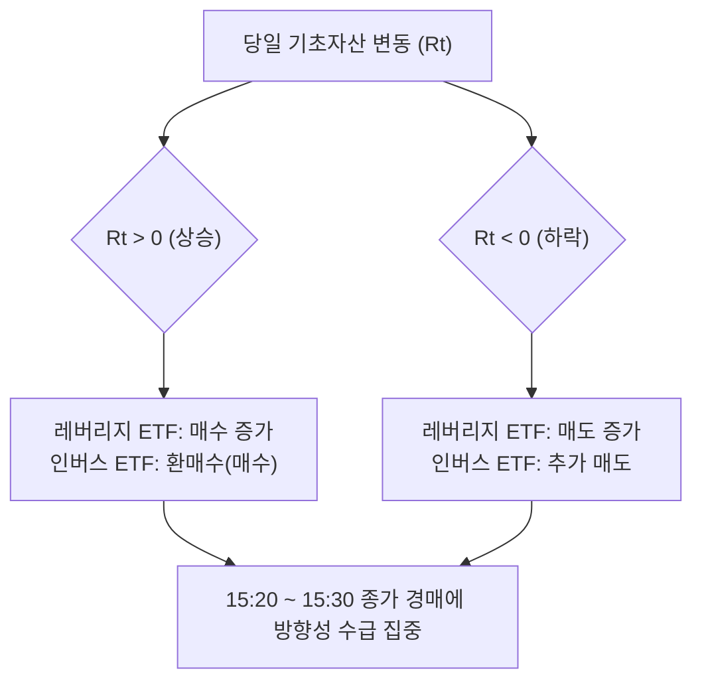

# H1 구조적 수급 예측과 개인 투자자의 비용 후 우위 분석 (Flow Anticipation & Retail Edge)

- **작성일**: 2026-07-19
- **목적**: 레버리지/인버스 ETF의 목표 배율 리밸런싱, 지수 정기 변경 등 '기계적·공개 규칙 기반의 예측 가능한 수급(flow)'을 미리 예측하여 포지셔닝할 때, 개인 투자자(Retail)가 현실적으로 도달할 수 있는 거래 비용 차감 후의 우위(Edge) 영역과 구조적 열위(Pitfalls)를 정직하고 정밀하게 설계합니다.
- **원칙**: 비공개 주문 정보, 내부자 정보, 시세조종, 선행매매(Illegal Front-running)는 원천 배제하며, 오직 공개된 펀드 규칙 및 시장 통계만을 활용합니다.

---

## 1. 예측 가능한 기계적 Flow 발생 메커니즘 및 타이밍

대형 패시브 및 차익거래 주체들은 추적 오차 최소화나 강제 청산 등의 제약 조건으로 인해 특정 시간대에 기계적이고 예측 가능한 방향성 수급을 생성합니다.



### 1.1. 레버리지/인버스 ETF/ETN 일일 리밸런싱
- **발생 메커니즘**: 일일 복리 목표배율(예: +2x, -2x, -1x)을 유지하기 위해 당일 기초자산의 등락률($R_t$)에 비례하여 기초자산 델타 노출액을 재조정(Rebalancing)해야 합니다.
- **타이밍**: 매 거래일 **15:20 ~ 15:30 KST (종가 단일가 경매 시간)**에 집중 실행됩니다.
- **수급의 부호**:
  - **기초자산 상승 ($R_t > 0$)**: 레버리지(+2x)는 순매수(+), 인버스(-2x)는 환매수(+) $\rightarrow$ **동반 매수 압력** 유입.
  - **기초자산 하락 ($R_t < 0$)**: 레버리지(+2x)는 순매도(-), 인버스(-2x)는 추가 매도(-) $\rightarrow$ **동반 매도 압력** 유입.

### 1.2. 지수 편출입 및 정기 리밸런싱 (Index Rebalancing)
- **발생 메커니즘**: MSCI, FTSE, KOSPI 200 등 주요 지수의 정기 변경에 따라, 해당 지수를 복제하는 글로벌 패시브 자금(지수 추종 자금)이 포트폴리오를 변경해야 합니다.
- **타이밍**: 지수 변경 효력 발생일(Effective Date) **직전 거래일의 종가 단일가 경매 (15:20~15:30 KST)**에 일시에 집행됩니다.
- **수급의 부호**: 신규 편입 종목은 **매수(+)**, 편출 종목은 **매도(-)**.

### 1.3. 공매도 과열 및 강제 숏커버링 (Short Squeeze Flow)
- **발생 메커니즘**: 대규모 공매도 포지션을 구축한 주체가 예상치 못한 호재나 리밸런싱 수급으로 주가가 급등할 때, 손실 한도(Stop-loss) 도달 또는 마진콜로 인해 숏 포지션을 기계적으로 환매수(Buy-to-cover)해야 합니다.
- **타이밍**: 장 마감 직전(15:00~15:20) 또는 종가 단일가 경매 시간.
- **수급의 부호**: 항상 **매수(+)** 수급으로 작용하며, 리밸런싱 매수 압력과 맞물릴 때 가격 상승을 폭발적으로 가속화합니다.

---

## 2. 개인 투자자 선행 포지셔닝 알고리즘 설계

개인이 공개 정보를 활용해 기계적 flow에 선행하여 유동성을 먼저 확보한 뒤, 종가 단일가 시점에 이를 대형 수급 주체에게 청산하는 구체적 알고리즘 3가지를 설계합니다.

### [알고리즘 1] 레버리지 리밸런싱 델타 타겟팅 (Anticipatory Leverage Rider)
- **신호 (Signal)**: 당일 15:00 KST 기준 SK하이닉스의 장중 일일 수익률 $R_{t, 15:00} = P_{t, 15:00}/P_{t-1,\text{close}} - 1$.
  - 임계값 조건: $|R_{t, 15:00}| \ge 2.0\%$ 이고, 당일 20일 거래대금 대비 리밸런싱 예측 노출량 비율($\text{EstimatedPressure} \ge 0.1\%$)일 때 진입.
- **진입 (Entry)**: 15:05 ~ 15:15 KST 사이에 분할 진입.
  - $R_{t, 15:00} \ge 2.0\%$: 매수(Long) 진입.
  - $R_{t, 15:00} \le -2.0\%$: 대차 매도(Short) 또는 보유 현물 매도 진입.
- **청산 (Exit)**: 15:20~15:30 종가 단일가 경매에 **전량 시장가(또는 종가 지정가)로 청산**하여 빠져나옴.

### [알고리즘 2] 지수 정기 리밸런싱 유동성 공급 (Index Liquidity Provider)
- **신호 (Signal)**: 주요 지수 정기 변경 효력 발생 직전일($t$) 15:00 KST, 지수 신규 편입이 확정된 종목 유니버스.
- **진입 (Entry)**: 15:10 KST에 목표 종목 매수(Long) 진입.
- **청산 (Exit)**: 15:20 단일가 경매 개시 직후, 종가에 무조건 체결되어야 하는 패시브 펀드의 대량 매수 주문(Market-On-Close)에 대고 **예상 체결가보다 약간 높은 지정가 매도 호가**를 제출하여 유동성을 공급하고 청산.

### [알고리즘 3] 장말 프로그램 매매 동조 추종 (EOD Program Follower)
- **신호 (Signal)**: 15:00 KST 기준 특정 외국계/기관 창구(프로그램/차익 거래를 전담하는 PB 창구)의 당일 순매수 대금이 해당 종목 평균 일일 거래량(ADV)의 10%를 초과하는 비정상 유입 관측 시.
- **진입 (Entry)**: 15:05 ~ 15:10 KST 매수(Long) 진입.
- **청산 (Exit)**: 15:30 종가 단일가에 전량 매도 청산.

---

## 3. 개인 투자자의 구조적 열위 및 유동성 함정 (Pitfalls)

개인이 위 알고리즘을 단순 실행할 경우, 아래와 같은 구조적 장벽으로 인해 대형 기관의 차익 청산 상대방(Exit Liquidity)으로 전락하여 손실을 볼 위험이 매우 높습니다.

### 3.1. 지연 시간(Latency)의 절대적 열위
- **함정**: 초단타 알고리즘 매매를 수행하는 HFT 및 기관 차익 거래자들은 이미 14:50 이전에 장중 가격 추이를 분석해 선행 진입을 완료해 놓은 상태입니다. 개인이 15:05~15:10에 진입하는 시점은 이미 가격 상승의 상당 부분이 반영된 **최정점(Over-anticipation)**일 수 있으며, 단일가 경매 시점에 기관이 던지는 매도 물량을 개인이 떠안으며 청산 상대방이 되는 함정에 빠집니다.
- **회피 규칙**: 15:00 시점 기준, 당일 주가 상승 폭이 과거 통계적 평균 가격 충격(Price Impact) 한계치 대비 1.5배 이상 이미 과도하게 상승해 있는 경우 진입을 강제로 금지(Cut-off)합니다.

### 3.2. 거래 비용(Friction Costs)의 열위
- **함정**: 대형 기관은 거래세 면제 혜택(우정사업본부 등)이나 극도로 낮은 수수료율을 적용받는 반면, 개인은 거래세(0.18%), 왕복 수수료, 매수-매도 호가 스프레드(Slippage) 비용을 온전히 지불해야 합니다. 수급 압력에 따른 종가 수익률의 기댓값이 +0.25%라 하더라도 마찰 비용이 $0.25\%\sim0.30\%$에 달해 **비용 차감 후 순이익이 음(-)의 영역**으로 수렴하게 됩니다.
- **회피 규칙**: 백테스트 시뮬레이션 시 슬리피지를 최소 1호가 이상 강제 차감하고, 거래 비용을 보수적으로 0.28% 반영한 모형에서도 초과 성과가 검증되는 매매 기회에만 참여합니다.

### 3.3. 호가창 정보 왜곡 및 Spoofing/Iceberg 주문
- **함정**: 15:20~15:30 단일가 경매 시간 동안 대형 기관들은 대규모 허수 주문(Spoofing)이나 숨겨진 주문(Iceberg Order)을 배치해 예상 체결가를 의도적으로 끌어올리거나 내립니다. 개인은 호가창의 가짜 예상 체결가에 속아 불리한 가격으로 주문 정정을 유도당해 털리게 됩니다.
- **회피 규칙**: 15:20 단일가 시작 시점 이후에는 어떠한 신규 정정 주문도 내지 않고 15:20 이전의 가격을 기준으로 한 지정가 주문을 완전히 동결(Freeze)합니다.

---

## 4. 개인이 현실적으로 우위를 가질 수 있는 좁은 영역 vs 우위가 없는 영역

개인은 자금과 인프라의 규모가 작고 강제적 매매 의무가 없다는 **'유연성의 강점'**을 극대화할 수 있는 매우 좁은 틈새에서만 우위를 확보할 수 있습니다.

```
[우위가 전혀 없는 영역]
  - 1ms 단위의 속도 경쟁 (OFI 선점)
  - 실시간 정보 파싱 속도 (지수 편출입 긴급 공시 반응)
  - 자금력을 앞세운 호가 밀어내기 (Price Push)

                  VS

[개인이 우위를 가질 수 있는 좁은 영역 (Edge)]
  - 유동성 강제 공급 기피 (유리한 호가에서만 선별 체결)
  - 종가 기계적 오버슈팅에 대한 익일 오전 되돌림 (Mean Reversion) 매매
  - 대형 패시브 펀드의 MOC(종가 보장 주문) 물량에 대고 극도의 리스크 프리미엄을 얹은 매도 호가 대기
```

- **우위가 전혀 없는 영역 (No Edge)**:
  - **HFT와의 속도 경쟁**: 1ms 단위로 호가를 변경하며 수급 불균형(OFI)에 대처하려는 시도는 무의미합니다.
  - **공시 즉시 반응**: 지수 편입 관련 돌발 뉴스나 공시를 파싱해 1초 만에 주문을 넣는 영역은 기관의 알고리즘 파서가 지배합니다.
- **개인이 우위를 가질 수 있는 영역 (Retail Edge)**:
  - **인내심(Patience)을 결합한 비대칭적 유동성 공급**: 대형 패시브 펀드는 종가에 무조건 전량 체결(Market-On-Close)해야 하는 제약이 있지만, 개인은 체결되지 않아도 아무런 불이익이 없습니다. 따라서 개인은 가장 유리한 호가(극단적 오버슈팅 호가)에 매도 주문을 배치해 놓고, 가격이 거기까지 튀어 체결될 때만 프리미엄을 챙기고 미체결 시에는 그냥 포지션 없이 마감하는 **'선택적 유동성 공급자'**의 지위를 누릴 수 있습니다.
  - **장말 오버슈팅의 익일 Mean Reversion 되돌림**: 리밸런싱 수급 집중으로 15:30 종가가 비이성적으로 오버슈팅/언더슈팅 마감한 경우, 익일 오전 09:00~09:30 사이에 기계적 반발 매수/매도로 가격이 되돌아오는 경향이 있습니다. 당일 장중에 위험을 안고 선행 진입하는 대신, **15:30 종가 시점에 오버슈팅된 가격의 역방향으로 진입하여 익일 아침에 청산**하는 전략은 개인이 거래소 인프라 열위를 우회하여 비용 후 우위를 누릴 수 있는 매우 유력한 틈새입니다.

---

## 5. 본 프로젝트의 데이터(KRX/KIS)를 통한 검증 시나리오

본 시스템에 구현된 데이터 파이프라인을 활용해 위 가설들을 정교하게 검증할 수 있습니다.

1. **리밸런싱 예상 수급의 역사적 델타 복원**:
   - `h1_krx_daily_proxy_reduced_v1` 데이터셋에 적재된 각 거래일별 개별 레버리지 상품의 NAV와 상장좌수를 결합하여, 과거 일별 이론적 리밸런싱 노출량을 완벽히 복원합니다.
2. **15:00 vs 15:30 가격 변동성 검증**:
   - KIS REST API의 분봉 조회 기능을 활용해 과거 각 영업일의 15:00 시점 가격(개인 선행 진입가), 15:20 시점 가격(단일가 시작 직전가), 15:30 최종 종가(청산가)를 추출합니다.
   - OLS 회귀분석을 통해 `15:00 진입 대비 15:30 청산` 시의 수익률 기댓값이 개인의 왕복 마찰 비용(수수료 및 슬리피지 합계 0.28% 가정)을 차감하고도 양(+)의 Sharpe Ratio를 내는지 통계적 유의성을 검정합니다.
3. **익일 되돌림(Mean Reversion) 효과 검증**:
   - $t$일 15:30 종가 오버슈팅 강도와 $t+1$일 09:10 시가 부근 가격 되돌림 간의 상관관계를 분석하여, 장중 거래 리스크 없이 마감 시점에만 유동성을 제공하는 전략의 실효성을 데이터로 실증할 수 있습니다.
